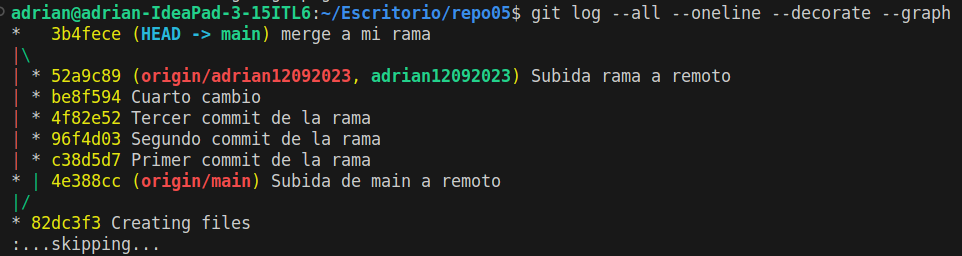

# EJERCICIO 5: NO FAST FORWARD

**□ 5.1 – Crea un directorio llamado repo05, esta vez tu decides como lo haces. Es decir, tendrás que seleccionar uno de los dos caminos que hemos visto en los dos ejercicios anteriores. Pero si que queremos que exista el repositorio el local y en remoto.**

Esta vez lo he hecho de la otra manera, en la que primero creo un repositorio remoto, después uno en local, y después los referencio.

Creo repositorio:

Inicializo un repositorio local:

Referencio los dos repositorios:

**□ 5.2 – Crea el fichero readme.md**

**□ 5.3 - Crea una rama con tu nombre y la fecha actual (por ejemplo en mi caso la rama se llamará adrian12092023) y sitúate en dicha rama**

**□ 5.4 – Haz 3 commits en la rama (adrian12092023)**

**□ 5.5 – En este caso, antes de hacer el merge sube ambas ramas al repositorio remoto. Verifica que se hayan subido correctamente. Lo hacemos así, ya que cuando realicemos el merge si nos equivocas podemos volver a clonar el repositorio sin necesidad de tener que volver a comenzar el ejercicio de 0.**

Subo mi rama al repositorio remoto:

Subo la rama principal al repositorio remoto:

Yendo a GitHub compruebo que las dos ramas están subidas:

**□ 5.6 – Basándote en el ejemplo que hemos visto anteriormente, realiza un commit no fast-forward en el que mergearemos la rama adrian12092023 con master.**

**□ 5.7 – Visualiza el resultado tanto mediante el comando git log --all --oneline --decorate --graph, como desde el pluging de VSC**

Con comando:

Con VSC:

**□ 5.8 – Explica las diferencias entre un merge FF y un merge no FF**

Con no FF se crea una confirmación y de esta manera podemos ver el historial de la rama mergeada.
En cambio, el merge FF fusiona directamente la nueva rama a la rama main sin confirmación, haciendo un poco más complicado el seguimiento de los movimientos realizados en las ramas.

---
# EJERCICIO 6: GIT

**□ Haz un alias con la finalidad de que cuando escribamos el comando git log adog nos ejecute lo siguiente:**

Los alias de GIT se crean en el documento .gitconfig; Este documento en linux lo he encontrado dentro de la carpte .git que se crea al inicializar el repositorio local. Dentro de la carptea .git hay un directorio "config".
Dentro de este archivo de texto he creado un apartado "[alias]" donde he creado el alias de la siguiente manera:

Una vez guardado el archivo pruebo el comando:
